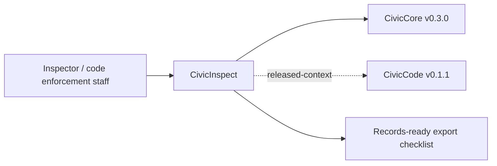

# CivicInspect User Manual

## For Non-Technical Users

CivicInspect helps inspectors and code-enforcement staff turn field notes into review-ready drafts. It can show sample repeat-case context, draft an inspection report from inspector-supplied notes, draft a notice for staff review, and prepare a records-ready export checklist.

Current state: `0.1.1` inspection support foundation release plus production-depth case persistence slice. CivicInspect can optionally persist repeat-case and report-draft records with `CIVICINSPECT_CASE_DB_URL`. It does not issue official findings, citations, fines, notices, inspection schedules, legal advice, live photo analysis, live LLM calls, or system-of-record updates. Inspectors own every decision.

## For IT and Technical Staff

CivicInspect is a FastAPI Python package pinned to `civiccore==0.3.0`. The current runtime exposes:

- `GET /`
- `GET /health`
- `GET /civicinspect`
- `POST /api/v1/civicinspect/cases/repeat-lookup`
- `POST /api/v1/civicinspect/reports/draft`
- `GET /api/v1/civicinspect/reports/{report_id}` when `CIVICINSPECT_CASE_DB_URL` is configured
- `POST /api/v1/civicinspect/notices/draft`
- `POST /api/v1/civicinspect/export`

Run:

```bash
python -m pip install -e ".[dev]"
python -m pytest -q
bash scripts/verify-release.sh
```

## Architecture



CivicInspect depends on CivicCore. CivicCore does not depend on CivicInspect. CivicInspect v0.1.1 uses deterministic sample inspection data only; local inspection configuration, CivicCode context APIs, live media review, and staff queues are future work.
