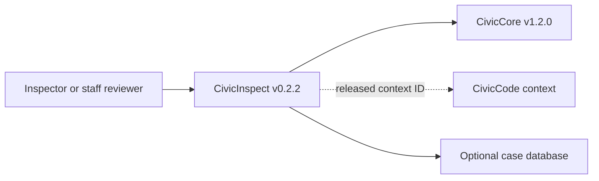

# CivicInspect User Manual

CivicInspect helps inspection staff turn field notes into review-ready inspection drafts while preserving staff control over every decision.

Current state: CivicInspect v0.2.2 corrective demotion state. This stage keeps the honest sub-1.0 label while aligning the runtime dependency to CivicCore 1.2.0. The module includes deterministic sample checks, optional database-backed repeat-case and report-draft records, staff review queue workflows, review-required CivicCode/case context packet support, adversarial local integration mocks, CivicCore v1.2.0 release-wheel alignment, and a public sample UI at `/civicinspect`.

## Runtime Surface

CivicInspect is a FastAPI Python package pinned to the published `civiccore v1.2.0` release wheel. The runtime exposes:

- repeat-case lookup,
- inspector-owned report draft creation,
- persisted report retrieval when a case database is configured,
- schema/readiness checks for local repeat-case records,
- staff-only review queue create/list/update/summary routes,
- review-required CivicCode/case context packets,
- adversarial local integration mocks,
- notice draft helpers,
- records-ready export checklists,
- API-backed public sample UI.

## Staff Configuration

Set `CIVICINSPECT_CASE_DB_URL` to persist repeat-case, report-draft, and staff queue records. Set `CIVICINSPECT_STAFF_API_KEY` before using staff-only queue routes. Staff routes require:

- `X-CivicInspect-Role: staff`
- `X-CivicInspect-Staff-Key: <configured key>`

This local API-key gate is a release safeguard, not a replacement for production identity, tenant scoping, and audit logging.

## Local Data Readiness

Use `civicinspect-db-status` to initialize/check the local case schema. Load municipal repeat-case CSV rows with `civicinspect-import-repeat-cases`; required columns are `property_key`, `property_reference`, `violation_type`, `related_case_ids`, and `staff_note`. `/ready` and `/api/v1/civicinspect/readiness` remain not-ready until `CIVICINSPECT_CASE_DB_URL` is configured and at least one local repeat-case record is loaded.

## Product Boundary

CivicInspect does not issue official findings, citations, fines, notices, inspection schedules, legal advice, live photo analysis, live LLM calls, or system-of-record updates.

## Architecture

```mermaid
flowchart LR
  Staff["Inspector or staff reviewer"] --> CivicInspect["CivicInspect v0.2.2"]
  CivicInspect --> CivicCore["CivicCore v1.2.0"]
  CivicInspect -. released context ID .-> CivicCode["CivicCode context"]
  CivicInspect --> DB["Optional case database"]
```

CivicInspect depends on CivicCore. CivicCore does not depend on CivicInspect. CivicInspect v0.2.2 uses deterministic sample data plus optional staff-gated persistence, review-required context packets for released CivicCode references, staff review queue records, and adversarial local mocks for integration-depth validation.
